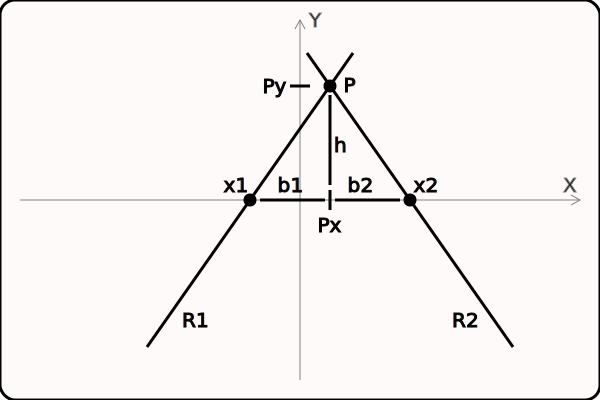

# star-drive

A novel(?) 2-axis cartesian motion system.

## Inspiration

Havig found a pair of high pitch ballscrews on Amazon, the need arose
for a budget friendly linear motion system with corresponding stiffness
for accuracy while being light-weight for speed.
The target applications for the project were engraving (PCB milling) and
3D printing.

A standard X-Y system has to balance cost, stiffness, and speed - a strong
frame is heavy, or both sides of one axis need to be driven by either
independent drive systems or cabling to prevent racking, and the entire mass
of the second axis is supported and moved by the first.

A crossed X-Y system greatly reduces the moving mass (all motors are
stationary), but has problems with racking on both axes, and it requires
additional linear rail.

The resulting design appears to be new, but you should perform your own
exhaustive search before doing anything with it.

## Description

Crossed rails are used to minimize driven mass, but the cross angle is nominally
60 degrees rather than 90.
This allows both cross rails to ride on the same drive rails with the motors
and ballscrews located on the same or opposite sides.

-- (overview diagram here)

Driving both cross rails the same distance along the drive rails causes the
platform to move an equal distance parallel to the drive rails.
Driving one cross rail a distance along the drive rails causes the platform
to move an equal distance along the other cross rail.
To move the platform perpendicular to the drive rails, the cross rails must
each be moved about 4/7 the desired distance, but in opposite directions.

The name, "* drive", was loosely based on the appearance of the crossed rails
and the simple directions of motion.

-- (motion diagrams here)

Compared to the standard 90 cross angle, one set of rails and a motor are
eliminated, as is the tendency for racking.
Calibration for orthogonal movement requires a handful of trivial measurements
with corrections applied in the controller software.

The biggest drawbacks are the cost of the ballscrews and the fact that the
range of usable motion is significantly less than the area enclosed by the
drive rails.

The system may be adapted to a Y-Z motion by extending the one set of drive
rails (Y range) and optionally adjusting the cross angle for finer control
of the Z position.

-- (Y-Z diagram here)

## Prototype

A quick prototype was built using unsupported 10mm round rail and blocks.
Note a belt drive was used here for simplicity.

The outside dimensions are approximately 19" x 24" with a hexagonal range of
motion about 9" per side.

With the corners clamped to the table, the deflection was measured at various
points and directions using the stepper's maximum unpowered holding torque as
a repeatable force gauge.
The deflection at the point where the belt attaches to a cross rail was
about 0.002".
Deflections at the platform were in the 0.005" to 0.010" range.

Lessons learned:

* The design is viable

  * Motion is very smooth
  * No racking or backlash is detectable
  * Probably good enough for moderate speed 3D printing

* This particular construction is weak

  * The frame is easily bent out of square
  * The longer drive rails deflect easily
  * The drive rails would be better if supported and rotate blocks to face inwards
  * All cross rails should be attached above the platform

    * Bringing centerlines closer to the drive rails reduces deflections by rotation
    * Improves clearance above the work piece
    * Keeps bearings away from the cutter

  * The platform mass could be reduced by machining it to capture the bearings
  * Lighter but paired cross rails should be considered

## Inverse Kinematics

The idealized geometry (ignoring all offsets) is shown in the diagram below.
Note the machine coordinate frame is in the center of the workspace.

Two cross rails, R1 and R2, are controlled to positions x1 and x2 along
the X axis.
The platform will then be found at the intersection of the rails at point P.

The controller has been calibrated with two values, the ratios
b1 / h and b2 / h.
To find the positions x1 and x2 corresponding to P at (Px, Py),
note that Py = h and the lengths b1 and b2 can be found by multiplying h
by the calibration values, and then x1 = Px - b1 and x2 = Px + b2.

Note all offsets can be pre-computed for two additions (x and y) to be applied
either before or after kinematics transformations.

## Calibration

Note that no absolute measurements are necessary, only differences in relative
positions and after motion.
Any convenient reference points may be used as long as the distance measured
is parallel to the direction of motion.

Note the parallel drive rails creates equal angles at the ends of each cross
rail and across the platform.
The triangles on opposite sides of the platform are therefore similar.
Everything should be adjusted to about 60 degrees with free motion, and then
calibration is used to correct the remaining error.

1- The two drive rails (D1 and D2) must be parallel. Adjust so both ends are
the same distance apart.

2- Adjust all blocks as needed to eliminate any binding.

3- Measure the distance traveled by blocks B1 for a known number of steps.
Repeat for blocks B2. These ratios calibrate each stepper's rotation to linear
motion along the X axis.

4- Position B1.a and B2.b far apart. Measure any reference along the three
sides of the triangle B1.a - B2.b - P. Optionally measure the opposite triangle
B2.a - B1.b - P.

5- Position B1.a and B2.b close together. Repeat the measurements of step (4).

6- Calculate the differences in the lengths of the sides between steps (4) and
(5). Use the differences to form the sides a similar triangle (same angles).

7- The new triangle is used to calculate ratios b1 / h and b2 / h needed for
inverse kinematics. Use Heron's formula to calculate the area, area and base
to calculate h, Pythagorean theorem with h and each side to calculate b1 and b2.
